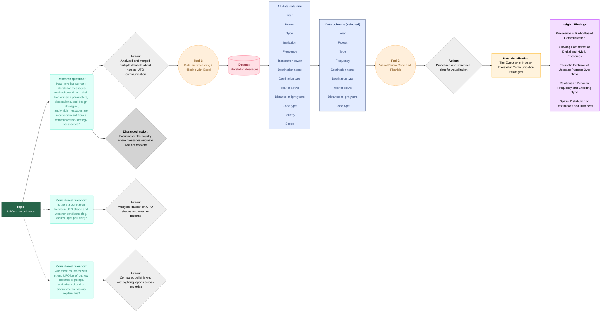

## DDD-2025-Group6
Elisa Caridi, Marianna Lonardi, Giorgia Salmoiraghi

# The Evolution of Human Interstellar Communication Strategies

## Visualisation

[Visualisation](https://mariannalonardi.github.io/DDD-2025-Group6/)

## Abstract 
This project analyzes the progression of human interstellar messages over time, considering transmission techniques, target selection, and design strategies. The study specifically focuses on encoding types and purposes across different periods, distances in light-years, and projected arrival times of the messages. It examines the predominant communication modes and investigates whether transmission frequency is influenced by the complexity or digital nature of the message. Insights emerge from structured data and visualizations, identifying key messages that shaped communication approaches and revealing trends in technological evolution and strategic choices in interstellar messaging.

## Protocol diagram

## What topic does the project address? 
The project addresses the topic of human interstellar communication, specifically investigating how messages sent by humans to potential extraterrestrial recipients have evolved over time. From our research question, that is "How have human‑sent interstellar messages evolved over time in terms of their transmission parameters, destinations, and design strategies, and which of these messages can be considered the most significant from a communication‑strategy perspective?", we examine changes in transmission techniques, target selection, encoding types, message purposes, distances and how technological and strategic considerations have influenced the design and delivery of these messages.

## What data have you considered? 
The project considers a mix of publicly accessible sources documenting human-sent interstellar messages, including:
- Historical and journalistic accounts describing attempts to communicate with extraterrestrial intelligence, such as the Amusing Planet article listing notable human interstellar transmissions.
- Partial dataset, encyclopedic and technical references, such as the Wikipedia list of interstellar radio messages and the Voyager Golden Record entry, detailing message content, design strategies, and delivery methods.

These sources together provide a comprehensive dataset for analyzing the evolution of message design and communication strategies in human interstellar messaging.

Main link:
- https://www.amusingplanet.com/2024/06/the-dozen-times-humans-have-tried-to.html
- https://en.wikipedia.org/wiki/List_of_interstellar_radio_messages?utm_source
- https://it.wikipedia.org/wiki/Voyager_Golden_Record?utm_source

## Dataset

| Year Sent | Project Name                                      | Communication Type     | Institution                                | frequency_MHz | Transmitter Power (kW) | Destination Name                            | Destination Type          | Year Arrival | Distance (ly) | Encoding Type                                      | Country        | Purpose                                                      | Purpose_2      |
|-----------|---------------------------------------------------|------------------------|--------------------------------------------|---------------|------------------------|---------------------------------------------|---------------------------|--------------|---------------|----------------------------------------------------|----------------|----------------------------------------------------------------|----------------|
| 1960      | Project Ozma                                      | Radio reception (SETI) | USA (National Radio Astronomy Observatory) | 1.420,00      | N/A                    | Tau Ceti                                    | Star                      | N/A          | 11,90         | N/A                                                | USA            | Passive search for extraterrestrial signals                  | Scientific     |
| 1962      | Morse Message                                     | Radio transmission     | Yevpatoria (USSR)                          | N/A           | N/A                    | Venus (direction of Libra)                  | Planet (not interstellar) | N/A          | 0,00027       | Morse code                                         | USSR           | Symbolic radar test                                          | Symbolic       |
| 1972      | Pioneer Plaques                                   | Physical message       | NASA                                       | N/A           | N/A                    | Interstellar space                          | Spacecraft trajectory     | N/A          | 24.100,00     | Engraved pictorial plaque                          | USA            | Symbolic message representing humanity                       | Symbolic       |
| 1974      | Arecibo Message                                   | Radio transmission     | Arecibo Observatory (USA)                  | 2.380,00      | 450,00                 | Messier 13 (M13)                            | Globular cluster          | 2074         | 25.000,00     | 1679-bit binary image (23×73)                      | USA            | Technological demonstration                                  | Scientific     |
| 1977      | Voyager Golden Record                             | Physical message       | NASA                                       | N/A           | N/A                    | Interstellar space                          | Spacecraft trajectory     | N/A          | N/A           | Analog audio + encoded images                      | USA            | Cultural representation of Earth                             | Cultural       |
| 1983      | Message to Altair (CALL to the COSMOS ’83)        | Radio transmission     | Stanford University                        | 424,00        | N/A                    | Altair                                      | Star                      | 2000         | 16,70         | N/A                                                | USA            | Symbolic / outreach message                                  | Symbolic       |
| 1986      | Poetica Vaginal                                   | Radio transmission     | MIT / Joe Davis                            | N/A           | N/A                    | Epsilon Eridani / Tau Ceti                  | Stars                     | N/A          | 11,00         | N/A                                                | USA            | Artistic / biological encoding experiment                    | Cultural       |
| 1999      | Cosmic Call 1                                     | Radio transmission     | RT-70 Evpatoria / Team Encounter           | 5.010,00      | 150,00                 | Multiple star systems                       | Star Systems              | 2068         | 50,00         | DDM/ISR structure + images + digital Rosetta Stone | Ukraine / USA  | Educational message; encyclopedic interstellar communication | Scientific     |
| 2001      | Teen Age Message (TAM)                            | Radio transmission     | RT-70 Evpatoria (Ukraine)                  | 5.010,00      | 111,00                 | Ursa Major / Gemini / Virgo / Hydra / Draco | Stars/star systems        | 2046         | 57,50         | Digital images + lexicon + music (theremin)        | Ukraine/Russia | Youth-created cultural message                               | Cultural       |
| 2003      | Cosmic Call 2                                     | Radio transmission     | RT-70 Evpatoria / Team Encounter           | 5.010,00      | 150,00                 | Cassiopeia / Andromeda / Cancer / Orion     | Star systems              | 2044         | 42,00         | Digital primers + images + Rosetta-like data       | Ukraine/USA    | Continuation of Cosmic Call encyclopedic message             | Scientific     |
| 2008      | A Message From Earth (AMFE)                       | Radio transmission     | RT-70 Evpatoria (Ukraine)                  | N/A           | N/A                    | Gliese 581                                  | Exoplanet                 | 2029         | 20,55         | Digital time capsule (501 messages)                | Ukraine        | User-submitted digital capsule                               | Cultural       |
| 2008      | Across the Universe                               | Radio transmission     | NASA / DSN Madrid                          | 7.145,00      | 18,00                  | Polaris direction                           | Supergiant star           | N/A          | 431,00        | N/A                                                | USA/Spain      | Musical message (Beatles)                                    | Cultural       |
| 2009      | Hello From Earth                                  | Radio transmission     | Canberra DSCC (Australia)                  | 7.145,00      | N/A                    | Gliese 581                                  | Exoplanet                 | N/A          | 20,55         | Short text messages (160 chars)                    | Australia      | Public crowdsourced messages                                 | Participatory  |
| 2012      | Wow! Reply                                        | Radio transmission     | SETI Institute                             | N/A           | N/A                    | Hipparcos 34511 / 33277 / 43587             | Stars                     | 2030         | N/A           | N/A                                                | USA            | Symbolic reply to the “Wow!” signal                          | Symbolic       |
| 2013      | Lone Signal                                       | Radio transmission     | Jamesburg Earth Station (USA)              | 1.426,45      | N/A                    | Gliese 526                                  | Red dwarf                 | 2031         | 17,73         | Hailing beacon + user-submitted messages           | USA            | Crowdfunded interstellar beacon                              | Participatory  |
| 2016      | A Simple Response to an Elemental Message (ASREM) | Radio transmission     | ESA / University of Edinburgh              | 8.656,30      | 34,53                  | Polaris                                     | Star                      | 2450         | 433.8         | Digital images/messages (256 kb/s)                 | Europe         | Public environmental + future-themed messages                | Cultural       |
| 2017      | Sónar Calling GJ273b                              | Radio transmission     | METI International + EISCAT Tromsø         | 931,00        | 1.500,00               | GJ 273b                                     | Red dwarf & exoplanet     | 2029         | 12,36         | Analog + digital music and math lessons            | Norway/Spain   | Musical + cultural outreach                                  | Cultural       |
| 2022      | A Beacon in the Galaxy (BITG)                     | Radio proposal         | Chinese FAST + ATA (USA)                   | N/A           | N/A                    | Milky Way dense star region                 | Galactic region           | N/A          | N/A           | Mathematics + biology + solar map                  | China/USA      | Scientific interstellar greeting (proposal)                  | Scientific     |
| 2023      | Message in a Bottle (MIAB)                        | Conceptual message     | Jonathan H. Jiang (NASA JPL)               | N/A           | N/A                    | Conceptual                                  | Conceptual                | N/A          | N/A           | N/A                                                | International  | Modern reinterpretation of

### Link to the dataset
https://docs.google.com/spreadsheets/d/1PBxZmiyp0CESrsS1gliosT1f5524Eus-cz922S-G3gc/edit?gid=0#gid=0

## What does the visualisation show?
- #### Spatial Distribution of Destinations and Distances

  The interactive map highlights a prevalence of relatively nearby destinations, typically between 10 and 60 light-years away. This trend suggests a shift from earlier experiments, in which messages were sometimes directed toward much more remote regions of deep space. Today, transmissions tend to target closer systems, reflecting a more pragmatic approach linked to the actual likelihood that extraterrestrial receivers could detect and decode them.
  
- #### Prevalence of Radio-Based Communication [🔗](https://public.flourish.studio/visualisation/26411061/)

   The analysis shows that almost all interstellar messages rely on radio as their primary transmission medium. This reflects the technological maturity of radio communication, its cost-effectiveness, and its ability to cover vast distances with high directional precision.

-  #### Growing Dominance of Digital and Hybrid Encodings  [🔗](https://public.flourish.studio/visualisation/26412583/)

   Visualizations of encoding types reveal a clear shift from symbolic or analog modes toward digital or multimodal encodings. After 1999, the use of mixed formats—combining images, linguistic structures, and musical content—becomes predominant, signalling an increase in informational complexity and expressive capacity.

-  #### Thematic Evolution of Message Purpose Over Time [🔗](https://public.flourish.studio/visualisation/26412403/)
   The timeline highlights three main phases:
    - 1960–1980: prevalence of scientific and symbolic intents associated with early SETI experiments.
    - 1990–2005: emergence of encyclopedic and highly structured projects aimed at transmitting knowledge (e.g., Cosmic Call).
    - 2008–present: substantial rise in cultural and participatory messages.
    
    This progression indicates a broadening of the sociocultural motivations behind interstellar communication.

-  #### Relationship Between Frequency and Encoding Type [🔗](https://public.flourish.studio/visualisation/26411110/)

      Frequency data show that digital and complex messages tend to be transmitted at higher frequencies, whereas analog or symbolic messages use lower ones. This suggests an association between frequency choice and the informational complexity of the message.
